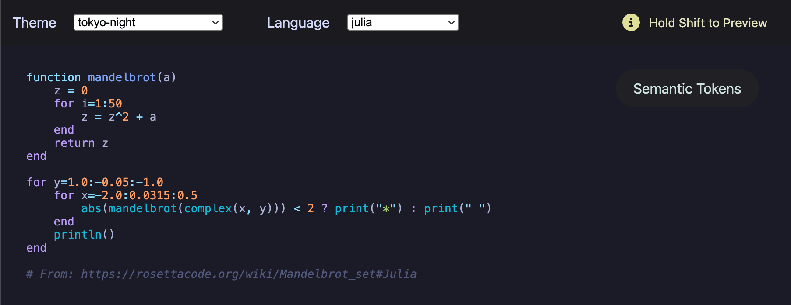

# LSP Syntax Highlighter

Add syntax highlighting to your LSP, officially compatible with VSCode and Cursor.

## Installation

Make sure you have a working LSP implementation integrated with VSCode. There are some samples provided by VSCode, and I can recommend https://github.com/semanticart/lsp-from-scratch/.

From your LSP's VSCode extension folder, run:

```
npm install lsp-syntax-highlighter
```

With the full list on the [contributes page](./contributes.md), add the following to your extension's package.json:

```json
{
  // ...
  "contributes": {
    // ... any others
    "configurationDefaults": {
      "editor.semanticHighlighting.enabled": true
    },
    "semanticTokenScopes": [
      {
        "scopes": {
          "color1.version1": ["meta.brace.square"],
          "color2.version1": ["beginning.punctuation.definition.list.markdown"],
          "color3.version1": ["brackethighlighter.angle"],
          "color4.version1": ["brackethighlighter.unmatched"],
          "color5.version1": ["carriage-return"],
          "color6.version1": ["comment"],
          "color7.version1": ["comment","keyword.codetag.notation"],
          "color8.version1": ["comment.block.documentation","entity.name.type"],
          "color9.version1": ["comment.block.documentation","entity.name.type","punctuation.definition.bracket"],
          "color10.version1": ["comment.block.documentation","markup.inline.raw.string.markdown"],
          "color11.version1": ["comment.block.documentation","punctuation"],
          "color12.version1": ["comment.block.documentation","storage"],
          "color13.version1": ["comment.block.documentation","storage.type"],
          "color14.version1": ["comment.block.documentation","support"],
          // ...
          "color297.version1": ["variable.language","punctuation.definition.variable.php"],
          "color298.version1": ["variable.language.this"],
          "color299.version1": ["variable.other.enummember"],
          "color300.version1": ["variable.parameter.function.swift","entity.name.function.swift"]
        }
      }
    ]
  }
}
```

With the full list on the [capabilities page](./capabilities.md), return the following in your LSP's initialization response:

```json
{
  "capabilities": {
    // ... any other capabilities
    "semanticTokensProvider": {
      "full": true,
      "legend": {
        "tokenTypes": [
          "color1",
          "color2",
          "color3",
          "color4",
          "color5",
          "color6",
          "color7",
          "color8",
          "color9",
          "color10",
          "color11",
          "color12",
          "color13",
          "color14",
          //...
          "color297",
          "color298",
          "color299",
          "color300",
        ],
        "tokenModifiers": ["version123"], // Use the version number on the capabilities page
      },
    },
  }
}
```

Add a handler for `textDocument/semanticTokens/full`:

```js
const Highlighter = require('lsp-syntax-highlighter')

const highlighterPromise = Highlighter({
  languages: [
    'js', // String referring to any language implemented in the Shiki library
    myLangGrammar // TextMate Grammar Theme in JSON
  ]
})

const myHandler = async (myTextDocument) => {
  const { highlight } = await highlighterPromise

  const { encodedTokens } = highlight(myTextDocument, { language: 'js' })

  return { data: encodedTokens }
}
```

## Highlighter Options

- `languages`: Array of language strings or custom TextMate grammars in JSON. For custom TextMate grammars make sure to include nested languages as well.

## Highlight Options

- `language`: A string referring to the language of the provided text. Will be a string even for custom TextMate grammars.
- `lineOffset`: Optional. The number of lines your code is down from the top of the document, zero-indexed.
- `columnOffset`: Optional. The number of columns your code starts from the left, zero-indexed.

## Methodology

To build the conversion database, I took a list of all 2978 unique scopes used in the prominent textmate grammars and themes in the Shiki library, and used a kmedioids clustering algorithm called fasterPAM to map similar scope to 300 core scopes.

## Advanced Usage

### Cluster Database

You can import the database which clusters the 2978 unique scopes into 300 semantic tokens:

```js
const { 
  fakeCssHexToSemanticToken, 
  fakeScopeMatchingTheme
} = require('textmate-grammar-to-semantic-tokens/database.json')
```

Running this theme with a library like Shiki will produce a CSS Hex that maps to the semantic token.

### Building The Database From Scratch

See the dedicated guide: [./build-database/README.md](./build-database/README.md)

### Using the Demo

You can spin up the same demo I used to confirm that the conversions are working. See the dedicated guide: [./demo/README.md](./demo/README.md)

