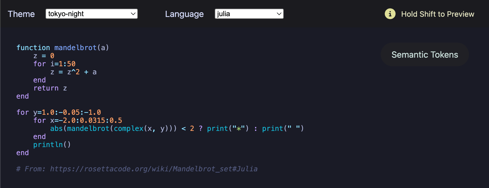

# LSP Syntax Highlighter

Add syntax highlighting to your language server, officially compatible with VSCode and Cursor.

**⚠️ Important Limitations**: The languages grammars you support must be packaged into your extension and cannot be dynamically loaded, and VSCode may experience poor performance if you include more than 2-3 complex languages (like JavaScript or Python), or 6-7 small languages (like JSON, HTML or CSS).

## Usage

```js
const { initializeHighlighter } = require('lsp-syntax-highlighter')
const jsonGrammar = require('./grammars/jsonGrammar.json')
const htmlGrammar = require('./grammars/htmlGrammar.json')
const cssGrammar = require('./grammars/cssGrammar.json')
const jsGrammar = require('./grammars/jsGrammar.json')

const grammars = [jsonGrammar, htmlGrammar, cssGrammar, jsGrammar]

const highlighterPromise = await initializeHighlighter({ grammars })

const mySemanticTokenHandler = async (textDocument) => {
  const { highlight } = await highlighterPromise

  const { encodedTokens, tokens } = highlight({ 
    text: textDocument,
    sections: [
      { startOffset: 21, endOffset: 68, grammar: 'json' },
      { 
        startOffset: 87,
        endOffset: 156,
        grammar: 'css',
        replacements: [
          { startOffset: 87, endOffset: 87, text: "style {" }
          { startOffset: 156, endOffset: 156, text: "}" }
        ]
      },
      { 
        startOffset: 170,
        endOffset: 349,
        grammar: 'html',
        replacements: [
          { startOffset: 191, endOffset: 310, text: '""' }
        ]
      },
      {
        startOffset: 211,
        endOffset: 310,
        grammar: 'css',
        replacements: [
          { startOffset: 211, endOffset: 211, text: 'style {' }
          { startOffset: 310, endOffset: 310, text: '}' }
        ]
      }
    ]
  })

  console.log(tokens)

  return { data: encodedTokens }
}
```

## Installation Guide

You will need a working LSP implementation that works with VSCode or Cursor. There are some samples provided by VSCode, and I can recommend https://github.com/semanticart/lsp-from-scratch/.

Install this package:

```
npm install lsp-syntax-highlighter
```

Inside your extension's repository, create a folder called "grammars" and populate it with JSON grammar files for the languages you want to support. There are a huge number of grammars collated by the Shiki library here: 

https://github.com/shikijs/textmate-grammars-themes/tree/main/packages/tm-grammars/grammars

For nested languages to work, ensure that you also include their grammars as well, for example HTML requires CSS and JS grammars since it can contain those languages inside style and script tags.

Run this command to create a lsp-syntax-builder-config.js file:

```
npx lsp-syntax-highlighter-builder --init
```

Take a look at the lsp-syntax-builder-config.js file. You will see official configurations for a few languages. If your language is missing, you can still proceed, however the default settings will be used. If you are ultimately not happy with the quality of your highlighting you can add an entry for your language and try tweaking the settings to get better results.

Once you have all the grammars in the folder, you are ready to run the build command that will precalculate all the possible scopes that can be generated by the grammar:

```
npx lsp-syntax-highlighter-builder
```

Please be aware that in some cases this script can take 30-40 minutes to complete.

The script creates two files:

- `grammars/highlighter/database.json`
- `contributes.json`

The script will output the number of colors generated:

```
3345 colors generated
```

Take note of this number.

The content of contributes.json needs to be copy pasted into your package.json, and then the file can be deleted.

The lsp-syntax-builder-config.js file is no longer needed and can be deleted.

In your LSP, you need to return the following for the 'initialization' request:

```js
const { getColorList } = require('lsp-syntax-highlighter')

const initializeHandler = () => {
  return {
    capabilities: {
      // ... 
      semanticTokensProvider: {
        legend: {
          tokenTypes: getColorList(3345),
          tokenModifiers: [],
        },
        full: true,
      },
    },
    // ...
  };
}
```

The exact format of the initializeHandler function will depend on your language server implementation.

Replace 3345 with the number from the output above.

Add a handler for `textDocument/semanticTokens/full`:

```js
const { initializeHighlighter } = require('lsp-syntax-highlighter')
const grammars = require('./grammars')

const highlighterPromise = await initializeHighlighter({ grammars })

const mySemanticTokenHandler = async (textDocument) => {
  const { highlight } = await highlighterPromise

  const { encodedTokens, tokens } = highlight({ 
    text: textDocument,
    sections: [
      { 
        startOffset: 170,
        endOffset: 349,
        grammar: 'html',
        replacements: [
          { startOffset: 191, endOffset: 310, text: '""' }
        ]
      },
    ]
  })

  console.log(tokens)

  return { data: encodedTokens }
}
```

The exact format of the handler function will depend on your language server implementation.

## API Documentation

### The `initializeHighlighter` Function

The top level function that asynchronously starts the highlighter and returns the highlight function.

```js
const { 
  highlight // The main highlight function described below
} = await initializeHighlighter({
  grammars // An array of JSON grammars
})
```

### The `highlight` Function
The highlight function uses the same grammar tokenizer built into VSCode, and then highlights the text using the pregenerated database you created during the installation steps.

```js
const { 
  encodedTokens, // The series of numbers required by the LSP standard
  tokens, // A human-readable list of tokens useful for debugging
} = highlight({
  text, // The full text of the document you are highlighting
  sections, // The main highlighting config, described below
})
```

### The `sections` Array

```js
const sections = [{
  startOffset, // A number referring to an index on the text document being highlighted
  endOffset, // The end number
  grammar, // The grammar name, which needs to match the name the grammar gives itself. This can be tricky, like CSS calls itself "css" but "js" calls itself "javascript". The name can be found at the top level of the grammar file.
  replacements: [
    // An array of alterations that you want to make to the text before sending it to the highlighter. Useful for priming the grammar into a specific state or removing string replacements like `my string with an ${insertion}` in JavaScript.
    { 
      startOffset: replacementStart, // An index number which needs to be within the text document
      endOffset: replacementEnd, // The end number. Can be the same as the startOffset in the case that you want to add text without removing any.
      text: replacementText, // Text to insert within the offsets. Can be an empty string if you simply want to remove text.
    }
  ]
}]
```

## Using the Demo

You can spin up the same demo I used to confirm that the highlighting is working. See the dedicated guide: [./demo/README.md](./demo/README.md)

